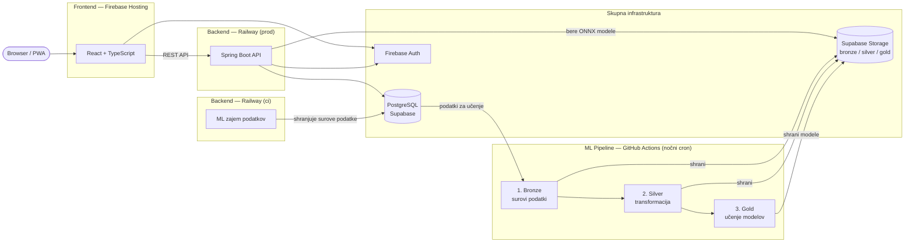

<p align="center">
  <a href="https://sibam.si">
    <picture>
      <source media="(prefers-color-scheme: dark)" srcset="assets/logo-celi-belo-besedilo.svg">
      <source media="(prefers-color-scheme: light)" srcset="assets/logo-celi-crno-besedilo.svg">
      
    </picture>
  </a>
  <br>
  <em>
  <a href="https://sibam.si">sibam.si</a></em>
  <br>
  <em>Multimodalna mobilnost Maribora.</em>
  <br>
  <em>Avtorji:  Kaja Vidmar, Gal Badrov, Miha Govedič</em>
</p>

<p align="center">
  
  
  
  
  
  
  
  
  <a href="https://sonarcloud.io/summary/overall?id=MikeDQG_sibam"></a>
  <a href="https://sonarcloud.io/summary/overall?id=MikeDQG_sibam_frontend"></a>
</p>

ŠibaM je spletna aplikacija za načrtovanje multimodalnih poti po Mariboru in okolici. Združuje podatke o avtobusnih prevozih (Marprom/GTFS), mestnih kolesih (mBajk) in vremenskih razmerah ter uporabniku predlaga optimalno pot glede na čas, vreme in želeno modalnostjo.

---

## Kazalo

- [O projektu](#o-projektu)
- [Funkcionalnosti](#funkcionalnosti)
    - [Diagram primerov uporabe](#diagram-primerov-uporabe)
- [Arhitektura](#arhitektura)
    - [Frontend](#frontend)
    - [Backend — Railway `prod`](#backend--railway-prod)
    - [Backend — Railway `ci`](#backend--railway-ci)
    - [ML pipeline — GitHub Actions](#ml-pipeline--github-actions)
    - [Skupna infrastruktura](#skupna-infrastruktura)
- [Za razvijalce](#za-razvijalce)
    - [Vodenje projekta](#vodenje-projekta)
    - [Namestitev in zagon](#namestitev-in-zagon)
    - [Commit sporočila](#commit-sporočila)
    - [Standardi kodiranja](#standardi-kodiranja)
    - [Strategija vej](#strategija-vej)
- [Zagotavljanje kakovosti](#zagotavljanje-kakovosti)
    - [Sledenje napakam](#sledenje-napakam)
    - [Testiranje](#testiranje)
    - [SonarQube](#sonarqube)
- [Deployment](#deployment)
    - [Backend — Docker](#backend--docker)
    - [Frontend — Firebase Hosting](#frontend--firebase-hosting)
    - [ML pipeline — GitHub Actions](#ml-pipeline--github-actions-1)
    - [Startup sekvenca — Railway `prod`](#startup-sekvenca--railway-prod)

---

## O projektu

Projekt je nastal kot zaključni projekt programa Informatika in opdatkovne tehnologije, na Fakulteti za računalništvo, elektrotehniko in informatiko Univerze v Mariboru. Cilj je bil razviti delujočo multimodalno navigacijsko aplikacijo, ki rešuje realno težavo pomanjkanja integriranega načrtovalca poti v Mariboru. Gre za spletno aplikacijo, ki deluje tudi kot PWA (Progressive Web App). Na mobilnih napravah jo je mogoče namestiti na začetni zaslon ter uporabljati podobno kot nativno aplikacijo, brez obiska trgovine z aplikacijami.

Jedro aplikacije je usmerjevalni graf, ki združuje postajališča Marprom avtobusov, postaje mBajk koles in pešpoti v enotno omrežje. Iskanje optimalne poti poteka z algoritmom A\*, ki dinamično upošteva vozni red avtobusov, razpoložljivost koles in trenutne vremenske razmere. Dež podraži kolesarjenje in hojo, mraz poveča strošek daljših peš etap, vročina pa zmanjša privlačnost hoje. Algoritem vrne do tri najprimernejše poti med katerimi lahko uporabnik izbira.

V ozadju se redno učijo ML modeli, ki za vsako mBajk postajo napovedujejo število prostih koles in stojal ter verjetnost, da bo kolo oziroma stojalo dejansko razpoložljivo ob uporabnikovem prihodu. Ločen model napoveduje zamude Marprom avtobusov, pri vseh modelih pa na napovedi vpliva tudi vremensko stanje. Napovedi se vgradijo neposredno v izračunane poti, zato uporabnik že pred odhodom vidi realistično sliko, ne le urnika, ampak pričakovano stanje.

Uporabnik za načrtovano pot dobi tudi navodila korak-za-korakom, ki jim lahko sledi v realnem času. Načrtovanje poti podpira odhod takoj, ob določeni uri ali prihod do cilja do izbranega časa, za katerikoli dan v naslednjem tednu.

Registrirani uporabniki si lahko shranijo priljubljene lokacije (npr. Dom, Služba) in jih in jih izberejo kot izhodišče ali cilj brez ročnega vnosa naslova. Celotne izračunane poti je mogoče shraniti in kadarkoli znova odpreti, brez ponovnega iskanja.

---

## Funkcionalnosti

- **Načrtovanje multimodalne poti** — kombinacija hoje, mBajk koles in Marprom avtobusov z A\* algoritmom na grafu
- **Prilagajanje glede na vreme** — dež, mraz in vročina vplivajo na stroške poti v realnem času
- **Ogled trenutnega vremena** — prikaz aktualnih vremenskih razmer v Mariboru
- **ML napovedi** — napoved razpoložljivosti koles ob prihodu na postajo in zamude avtobusa
- **Korak-za-korakom navigacija** — navodila za kolesarsko etapo prek Google Routes API
- **Sledenje v realnem času** — sledenje navodilom med potovanjem
- **Uporaba lokacije** — samodejno določanje izhodišča prek GPS
- **Shranjene lokacije** — shranjevanje priljubljenih mest (Dom, Služba…); vidne na glavnem zemljevidu in dostopne direktno iz obrazca za iskanje
- **Shranjene poti** — shranjevanje izračunanih poti za kasnejšo uporabo; pot je mogoče znova narisati na glavnem zemljevidu
- **Uporabniški račun** — registracija in prijava prek Firebase
- **Svetla/temna tema** — preklapljanje med svetlim in temnim načinom izgleda

### Diagram primerov uporabe

<picture>
  <source media="(prefers-color-scheme: dark)" srcset="docs/diagrami/DPU/DPUdark.png">
  
</picture>

---

## Arhitektura

Sistem je sestavljen iz štirih ločenih procesov, ki si delijo skupno infrastrukturo.

| Komponenta         | Tehnologije                                       | Gostovanje                  |
| ------------------ | ------------------------------------------------- | --------------------------- |
| **Frontend**       | React, TypeScript, Vite, Tailwind CSS, shadcn/ui  | Firebase Hosting            |
| **Backend `prod`** | Java 21, Spring Boot, Hibernate/JPA, ONNX Runtime | Railway                     |
| **Backend `ci`**   | Java 21, Spring Boot, Hibernate/JPA               | Railway                     |
| **ML pipeline**    | Python 3.11, scikit-learn, pandas, ONNX           | GitHub Actions (nočni cron) |



---

### Frontend

React SPA, ki deluje tudi kot PWA — na mobilnih napravah se jo da namestiti na začetni zaslon brez obiska trgovine. Zgrajen z Vite, stilirana s Tailwind CSS in shadcn/ui komponentami.

Ključni sklopi:

- **Zemljevid** — Google Maps JavaScript API prek `@vis.gl/react-google-maps`; postajališča in poti se rišejo z `AdvancedMarker` in `Polyline` elementi.
- **Iskanje poti** — obrazec za vnos izvora, cilja in časa odhoda/prihoda; kliče `POST /compute` na backendu in prikaže do tri alternativne poti z etapami.
- **Korak-za-korakom navigacija** — sledenje aktivnemu koraku med potovanjem v realnem času.
- **Shranjene lokacije in poti** — upravljanje prek uporabniškega profila; shranjene lokacije in poti so dosegljive direktno iz obrazca za iskanje.
- **Avtentikacija** — Firebase Authentication (Google Sign-In in e-pošta/geslo); JWT žeton se pošilja v `Authorization` glavi vsakega zahtevka.

Ob vsakem merge v `main` se frontend samodejno deploya na Firebase Hosting prek GitHub Actions. Odprti PR-ji dobijo preview kanal.

---

### Backend — Railway `prod`

Spring Boot aplikacija, ki ob zagonu izvede naslednjo sekvenco:

```
BikePredictionService.loadModels()    — prenese 4 ONNX modele iz Supabase Storage gold/models/
BusDelayPredictionService.load()      — prenese model_bus_delay.onnx + naloži stop_direction_mapping.json
GraphBootstrap.init()                 — zgradi routing graf iz GTFS, mBajk in vremenskih podatkov
aplikacija začne sprejemati zahtevke na :8080
vsak dan ob 3:30 UTC: SchedulerService.reloadMlModels()
```

#### Routing graf

Celoten multimodalni graf živi v RAM-u kot `MultimodalGraph` — za Maribor zasede le nekaj MB, kar omogoča iskanje poti v milisekundah brez klicev na bazo.

Graf vsebuje dve vrsti vozlišč (`BUS_STOP`, `BIKE_STATION`) in tri vrste robov:

| Tip roba      | Opis                                                                |
| ------------- | ------------------------------------------------------------------- |
| `TransitEdge` | Avtobusna linija — časovno odvisen rob z seznamom odhodov           |
| `WalkingEdge` | Pešpot — med postajami v bližini, do mBajk postaj, od/do uporabnika |
| `BikeEdge`    | Kolesarska etapa med dvema mBajk postajama                          |

Iskanje poti poteka z algoritmom **A\***. Stroški robov se dinamično prilagajajo vremenu: dež podraži kolesarjenje in hojo, mraz poveča strošek daljših peš etap, vročina zmanjša privlačnost hoje. Algoritem vrne do tri najprimernejše poti.

#### ML inferenca

Backend ob zagonu naloži pet ONNX modelov iz Supabase Storage bucket `gold/models/` — modeli se ne shranijo na disk, ampak ostanejo v pomnilniku kot `OrtSession` objekti.

| Model                        | Tip                        | Izhod                                        |
| ---------------------------- | -------------------------- | -------------------------------------------- |
| `model_bikes.onnx`           | GradientBoostingRegressor  | napovedano število prostih koles             |
| `model_stands.onnx`          | GradientBoostingRegressor  | napovedano število prostih stojal            |
| `model_available_bike.onnx`  | GradientBoostingClassifier | verjetnost, da bosta na voljo vsaj 2 kolesi  |
| `model_available_stand.onnx` | GradientBoostingClassifier | verjetnost, da bosta na voljo vsaj 2 stojali |
| `model_bus_delay.onnx`       | Ridge regresija            | napovedana zamuda avtobusa v sekundah        |

Napovedi se vgradijo v odgovor `POST /compute` — vsaka kolesarska etapa dobi `BikeLegPredictionVao`, vsaka avtobusna etapa pa `BusLegDelayVao`. Vsako noč ob **3:30 UTC** (2,5h po zagonu ML pipeline-a) `SchedulerService` prenese nove modele in zamenja `OrtSession` z `synchronized` blokom, ki prepreči sočasno inferenco med zamenjavo.

---

### Backend — Railway `ci`

Ista Spring Boot aplikacija z aktivnim Spring profilom `ci`. Ne gradi routing grafa, ne naloži ONNX modelov in ne streže HTTP zahtevkov — teče izključno `SchedulerService`, ki zbira podatke za ML trening. Podatke shranjuje v PostgreSQL prek Hibernate/JPA, enako kot `prod`.

| Scheduler                 | Frekvenca      | Vir            | Tabela                                    |
| ------------------------- | -------------- | -------------- | ----------------------------------------- |
| `fetchBikeIngestion()`    | vsakih 5 minut | JCDecaux API   | `bike_stations`, `bike_station_snapshots` |
| `fetchWeatherIngestion()` | vsako uro      | OpenWeatherMap | `weather_snapshots`                       |
| `fetchBusIngestion()`     | vsako minuto   | GTFS-RT        | `trip_snapshots`, `stop_delay_snapshots`  |

Schedulerji delujejo samo med **05:00 in 23:00** po lokalnem času. Napake se beležijo v log — scheduler se ne ustavi.

---

### ML pipeline — GitHub Actions

Nočni cron ob **1:00 UTC** izvede tri Python skripte zaporedno:

**1. `export_to_lake.py` — Bronze plast**
Prebere staging tabele iz PostgreSQL in jih izvozi kot Parquet datoteke v Supabase Storage bucket `bronze`. Po uspešnem izvozu počisti staging podatke, starejše od treh dni.

| PostgreSQL tabela        | Bronze pot                              |
| ------------------------ | --------------------------------------- |
| `bike_station_snapshots` | `bronze/bikes/snapshots_<date>.parquet` |
| `weather_snapshots`      | `bronze/weather/weather_<date>.parquet` |
| `trip_snapshots`         | `bronze/buses/trips_<date>.parquet`     |
| `stop_delay_snapshots`   | `bronze/buses/delays_<date>.parquet`    |

**2. `transform_to_silver.py` — Silver plast**
Združi bronze Parquet datoteke v učna dataseta. Za kolesa poveže snapshote postaj z vremenskimi podatki → `silver/bikes/latest.parquet`. Za avtobuse poveže trip snapshote in delay snapshote z vremenskimi podatki → `silver/buses/latest.parquet`.

**3. `train_bikes.py` + `train_buses.py` — Gold plast**
Trenirata modele iz silver dataseta in shranita ONNX datoteke v `gold/models/`. Vhodni tenzor za kolesarske modele je oblike `[1, 7]`, za avtobusni model `[1, 9]` — vrstni red značilk mora biti enak pri treningu in ONNX inferenci v backendu.

---

### Skupna infrastruktura

**PostgreSQL (Supabase)** — tabele se delijo v dve skupini:

| Skupina             | Tabele                                                                                                   | Namen                                           |
| ------------------- | -------------------------------------------------------------------------------------------------------- | ----------------------------------------------- |
| Uporabniški podatki | `users`, `saved_locations`, `saved_paths`                                                                | Trajni podatki, dokler jih uporabnik ne izbriše |
| ML staging          | `bike_stations`, `bike_station_snapshots`, `weather_snapshots`, `trip_snapshots`, `stop_delay_snapshots` | Začasni — počistijo se po izvozu v bronze       |

**Supabase Storage** — trije bucketi:

| Bucket   | Vsebina                                                  |
| -------- | -------------------------------------------------------- |
| `bronze` | Surovi Parquet izvozi iz PostgreSQL (dnevni snapshoti)   |
| `silver` | Transformirani učni dataseti (`latest.parquet`)          |
| `gold`   | Natrenirani ONNX modeli, ki jih backend naloži ob zagonu |

**Firebase Authentication** — Google Sign-In in e-pošta/geslo. Backend verificira JWT žeton ob vsaki zahtevi prek Firebase Admin SDK.

---

**Podrobnejša dokumentacija po komponentah:**

- [docs/backend/](docs/backend/) — API, routing graf, zajem podatkov, deployment
- [docs/frontend/](docs/frontend/) — komponente, poti, testiranje
- [docs/strojno-ucenje/](docs/strojno-ucenje/) — podatkovni tok, modeli, operativni postopek
- [docs/varnost/](docs/varnost/) — varnost backenda in frontenda

---

## Za razvijalce

### Vodenje projekta

Projekt se vodi po **Scrum** metodologiji prek Jire.

- [Jira projekt — Scrum board](https://sibam.atlassian.net/jira/software/projects/SCRUM/boards/1?atlOrigin=eyJpIjoiZGJkYjM2NDQxN2I1NDdlZDkxNDlmNjM0MzJmNGFmNDUiLCJwIjoiaiJ9)

#### Tipi taskov

| Tip         | Namen                                                                           |
| ----------- | ------------------------------------------------------------------------------- |
| **Task**    | Naloga — nova funkcionalnost ali tehnična izboljšava                            |
| **Bug**     | Napaka v obstoječi funkcionalnosti (glej [Sledenje napakam](#sledenje-napakam)) |
| **Subtask** | Podnaloga znotraj Task taska                                                    |

#### Jira statusi

Vsak task sledi toku:

```
To Do → In Progress → In Review → Done
```

#### Jira identifikator

Vsak task dobi identifikator oblike `SCRUM-XX`, ki se **obvezno** vključi v commit sporočilo in ime veje — s tem je vsaka sprememba v kodi sledljiva do izvorne naloge v Jiri.

---

### Namestitev in zagon

#### Frontend

**Predpogoji:** Node.js 20+

```bash
cd frontend
npm install
```

Ustvari `frontend/.env`:

```
# Firebase — Firebase Console → Project Settings → Your apps
VITE_FIREBASE_API_KEY=
VITE_FIREBASE_AUTH_DOMAIN=
VITE_FIREBASE_PROJECT_ID=
VITE_FIREBASE_STORAGE_BUCKET=
VITE_FIREBASE_MESSAGING_SENDER_ID=
VITE_FIREBASE_APP_ID=

# Google Maps — Google Cloud Console
VITE_GOOGLE_MAPS_API_KEY=
VITE_PLACES_API_KEY=
VITE_GOOGLE_MAPS_MAP_ID=

# OpenWeatherMap
VITE_OPENWEATHER_API_KEY=

# Supabase — Supabase Console → Project Settings → API
VITE_SUPABASE_URL=
VITE_SUPABASE_PUBLISHABLE_KEY=

# Backend URL
VITE_API_URL=
```

```bash
npm run dev
```

Frontend lokalno teče na `http://localhost:5173`.

---

#### Backend

**Predpogoji:** Java 21, Maven

Ustvari `backend/src/main/resources/application-local.properties` (datoteka je v `.gitignore`):

```properties
# Podatkovna baza — Supabase Transaction Pooler
spring.datasource.url=
spring.datasource.username=
spring.datasource.password=
spring.datasource.driver-class-name=

# Zunanje storitve
mbajk.api.key=
openweathermap.api.key=
routes.google.api-key=

# Supabase Storage (za nalaganje ONNX modelov)
supabase.url=
supabase.service-key=

# Schedulerji — lokalno izklopljeni
schedulers.fetch-bike-ingestion.on=false
schedulers.fetch-weather-ingestion.on=false
schedulers.fetch-bus-ingestion.on=false
```

Za Firebase avtentikacijo postavi `backend/src/main/resources/firebase-service-account.json` (pridobi iz Firebase Console → Project Settings → Service Accounts; datoteka je v `.gitignore`).

```bash
cd backend
./mvnw spring-boot:run
```

Backend teče na `http://localhost:8080`. Spring profil `local` je aktiven privzeto.

> **Opomba:** ob zagonu backend naloži ONNX modele iz Supabase Storage in zgradi routing graf. Brez veljavnih vrednosti `supabase.url` in `supabase.service-key` se aplikacija ne bo uspešno zagnala.

---

#### ML pipeline

**Predpogoji:** Python 3.11

```bash
pip install -r ml/requirements.txt
```

Nastavi okoljske spremenljivke:

```
SUPABASE_URL=
SUPABASE_SERVICE_KEY=
SUPABASE_DB_URL=
```

Skripte se v produkciji izvajajo kot nočni cron prek GitHub Actions. Za lokalno testiranje jih je mogoče zagnati posamično v tem vrstnem redu:

```bash
python ml/export_to_lake.py       # PostgreSQL → bronze (Parquet)
python ml/transform_to_silver.py  # bronze → silver (transformacija)
python ml/train_bikes.py          # silver → gold (MBajk ONNX modeli)
python ml/train_buses.py          # silver → gold (avtobus ONNX model)
```

Podrobnejši operativni postopek: [docs/strojno-ucenje/operativni-postopek.md](docs/strojno-ucenje/operativni-postopek.md).

---

### Commit sporočila

Sporočila pišemo v **slovenščini** in obvezno vključimo Jira identifikator.

**Format:**

```
SCRUM-XX Kratek opis spremembe
```

**Primeri:**

```
SCRUM-15 Dodano zbiranje podatkov iz GTFS API-ja
SCRUM-19 Implementirana Firebase avtorizacija
SCRUM-42 Popravljeno nalaganje shranjenih poti
```

**Pravila:**

- Opis naj bo jasen in konkreten — ne "popravki" ali "spremembe"
- Piši v pretekliku (Dodano, Implementirano, Popravljeno)
- En commit = ena logična sprememba

---

### Standardi kodiranja

Koda se piše v **angleščini** v vseh komponentah.

| Kontekst                                     | Konvencija       | Primer                     |
| -------------------------------------------- | ---------------- | -------------------------- |
| Spremenljivke in funkcije (Java, TypeScript) | camelCase        | `fetchBikeData`            |
| Razredi (Java, TypeScript)                   | PascalCase       | `RouteCalculator`          |
| Konstante                                    | UPPER_SNAKE_CASE | `MAX_ROUTE_DISTANCE`       |
| Komponente in datoteke komponent (frontend)  | PascalCase       | `MainMap.tsx`              |
| Ostale datoteke (frontend)                   | camelCase        | `usePlacesAutocomplete.ts` |
| Spremenljivke in funkcije (Python)           | snake_case       | `export_to_lake`           |
| Datoteke (Python)                            | snake_case       | `train_bikes.py`           |

---

### Strategija vej

| Veja          | Namen                                      |
| ------------- | ------------------------------------------ |
| `main`        | Produkcijska veja — samo stabilna koda     |
| `development` | Aktivni razvoj — sem mergamo vse spremembe |

**Pravila:**

- Nikoli ne pushaj direktno na `main`
- Vse spremembe gredo prek `development`
- Za vsak feature ali popravek ustvari svojo vejo iz `development`

**Format imen vej:**

```
feat/SCRUM-XX-kratek-opis
fix/SCRUM-XX-kratek-opis
```

---

## Zagotavljanje kakovosti

### Sledenje napakam

Napake se dodajajo v Jiro kot **Bug** tip taska. V opis vključi:

- Podroben opis buga:
- časovne informacije,
- osebo, ki je izvedla testiranje,
- kontekst,
- opis incidenta,
- korake ponovitve,
- oceno resnosti,
- oceno prioritete (se označi v polju Priority),
- tveganje,
- status incidenta (se označi v polju TO DO),
- kdo je odgovoren za popravilo (se označi v polju Assignee).

Status se sledi prek Jira statusa: To Do → In Progress → In Review → Done. Bug se ustvari v Backlogu in prestavi v sprint, ko je popravek planiran.

---

### Testiranje

**Backend** uporablja JUnit 5 + Mockito + AssertJ za unit teste in Testcontainers za integracijske teste z bazo. Podrobnosti:

- [Testni načrt backenda](docs/backend/testing/testni-nacrt-backenda.md) — ogrodja, vrste testov, zagon
- [Unit testi](docs/backend/testing/unit-testi.md) — strategija po domenah
- [Integracijski testi](docs/backend/testing/integracijski-testi.md) — DB IT in ONNX IT

**Frontend** uporablja Vitest za unit/integracijske teste in Playwright za E2E.

- [Testni načrt frontenda](docs/frontend/testiranje/testni-nacrt-frontenda.md)
- [Integracijski testi frontenda](docs/frontend/testiranje/integracijski-testi-frontenda.md)

---

### SonarQube

Statična analiza kode se izvede samodejno ob vsakem pushu na `main` prek **SonarCloud**. Analiza pokriva backend in frontend ločeno.

| Komponenta | Pokritost meri | Coverage report                 |
| ---------- | -------------- | ------------------------------- |
| Backend    | JaCoCo         | `target/site/jacoco/jacoco.xml` |
| Frontend   | Vitest + V8    | `frontend/coverage/lcov.info`   |

SonarCloud preverja:

- **Code smells** — vzdrževalnostne težave
- **Bugs** — potencialne napake v logiki
- **Security hotspots** — mesta, ki zahtevajo varnostni pregled
- **Coverage** — odstotek pokritosti s testi
- **Duplications** — podvojena koda

Nekatere datoteke so namerno izključene iz analize ali pokritosti (Spring Data repozitoriji, JPA entitete, DTO razredi, ONNX servisi). Razlogi so opisani v:

- [Pokritost in izključitve — backend](docs/backend/testiranje/pokritost-sonarqube.md)
- [Pokritost in izključitve — frontend](docs/frontend/testiranje/pokritost-sonarqube.md)

#### Poročilo

**Backend**

[](https://sonarcloud.io/summary/overall?id=MikeDQG_sibam) [](https://sonarcloud.io/summary/overall?id=MikeDQG_sibam) [](https://sonarcloud.io/summary/overall?id=MikeDQG_sibam) [](https://sonarcloud.io/summary/overall?id=MikeDQG_sibam) [](https://sonarcloud.io/summary/overall?id=MikeDQG_sibam) [](https://sonarcloud.io/summary/overall?id=MikeDQG_sibam)

**Frontend**

[](https://sonarcloud.io/summary/overall?id=MikeDQG_sibam_frontend) [](https://sonarcloud.io/summary/overall?id=MikeDQG_sibam_frontend) [](https://sonarcloud.io/summary/overall?id=MikeDQG_sibam_frontend) [](https://sonarcloud.io/summary/overall?id=MikeDQG_sibam_frontend) [](https://sonarcloud.io/summary/overall?id=MikeDQG_sibam_frontend) [](https://sonarcloud.io/summary/overall?id=MikeDQG_sibam_frontend)

Posnetek zadnjega poročila je shranjen v [docs/sonarqube/](docs/sonarqube/).

Posnetek zadnjega poročila je shranjen v [docs/sonarqube/](docs/sonarqube/).

---

## Deployment

| Komponenta         | Platforma        | Sprožilec                       |
| ------------------ | ---------------- | ------------------------------- |
| Frontend           | Firebase Hosting | Merge v `main` (GitHub Actions) |
| Backend — API + ML | Railway (`prod`) | Ročno ali ob spremembi `main`   |
| Backend — ML zajem | Railway (`ci`)   | Vedno teče                      |
| ML pipeline        | GitHub Actions   | Vsako noč ob 1:00 UTC           |

### Backend — Docker

Backend se zapakira v Docker container s **dvostopenjskim buildom** (`backend/Dockerfile`):

- **Build stage** — Maven 3.9.9 + Eclipse Temurin JDK 21; odvisnosti se prenesejo ločeno od izvorne kode za boljše layer caching; testi so preskočeni (`-DskipTests`)
- **Runtime stage** — Eclipse Temurin JRE 21; vsebuje samo JAR datoteko brez build orodij

Railway samodejno zazna Dockerfile in zgradi container ob vsakem deploymentu. Port je `8080` — Railway ga nastavi prek `PORT` env spremenljivke.

### Frontend — Firebase Hosting

Frontend se zgradi z Vite in deploya prek GitHub Actions:

| Workflow                            | Sprožilec      | Cilj               |
| ----------------------------------- | -------------- | ------------------ |
| `firebase-hosting-merge.yml`        | Merge v `main` | Produkcijski kanal |
| `firebase-hosting-pull-request.yml` | Odprt PR       | Preview kanal      |

### ML pipeline — GitHub Actions

Nočni cron ob **1:00 UTC** izvede skripte v zaporedju: `export_to_lake.py` → `transform_to_silver.py` → `train_bikes.py` → `train_buses.py`. Backend nato ob **3:30 UTC** samodejno prenese nove modele iz Supabase Storage.

### Startup sekvenca — Railway `prod`

```
Docker container zažene JVM
  → BikePredictionService.loadModels()       — 4 ONNX modeli iz Supabase Storage
  → BusDelayPredictionService.load()         — model zamud + stop_direction_mapping.json
  → GraphBootstrap.init()                    — zgradi routing graf iz GTFS in mBajk podatkov
  → aplikacija sprejema zahtevke na :8080
  → vsak dan ob 3:30 UTC: reload ML modelov
```

Podrobnosti konfiguracije in env spremenljivk: [docs/deploy/deployment.md](docs/deploy/deployment.md)
