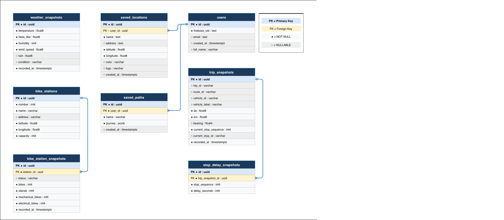

# Podatkovna baza

Backend uporablja PostgreSQL bazo, gostovano pri Supabase. Dostop poteka prek Hibernate/JPA z Spring Data repozitoriji. Vse entitete so v paketu `com.sibam.persistence`, repozitoriji pa v `com.sibam.repository`.

Tabele se delijo v dve skupini glede na namen:

| Skupina | Tabele | Namen |
| --- | --- | --- |
| Uporabniški podatki | `users`, `saved_locations`, `saved_paths` | Trajni podatki — shranjeni dokler jih uporabnik ne izbriše |
| ML staging | `bike_stations`, `bike_station_snapshots`, `weather_snapshots`, `trip_snapshots`, `stop_delay_snapshots` | Začasni podatki — po izvozu v Supabase Storage se počistijo |

## ER diagram

---

## Skupne lastnosti

- Primarni ključi so tipa `UUID`, generirani s strategijo `GenerationType.UUID` (Hibernate 7).
- Časovni stolpci so tipa `OffsetDateTime`.
- Baza je dostopna prek JDBC z `HikariCP` connection poolom (maks. 3 povezave, optimizirano za Supabase Transaction Pooler).

---

## Uporabniški podatki

### `User` — tabela `users`

Razred: [User.java](../../../backend/src/main/java/com/sibam/persistence/User.java)

| Polje | Stolpec | Tip | Omejitve |
| --- | --- | --- | --- |
| `id` | `id` | UUID | PK, generiran |
| `firebaseUid` | `firebase_uid` | String | unikaten, not null |
| `email` | `email` | String | — |
| `fullName` | `full_name` | String | — |
| `createdAt` | `created_at` | OffsetDateTime | — |

Repozitorij: [UserRepository.java](../../../backend/src/main/java/com/sibam/repository/UserRepository.java)

| Metoda | Opis |
| --- | --- |
| `findByFirebaseUid(String)` | Iskanje po Firebase UID — uporablja `UserService` pri vsaki zahtevi |

---

### `SavedLocation` — tabela `saved_locations`

Razred: [SavedLocation.java](../../../backend/src/main/java/com/sibam/persistence/SavedLocation.java)

| Polje | Stolpec | Tip | Omejitve |
| --- | --- | --- | --- |
| `id` | `id` | UUID | PK, generiran |
| `user` | `user_id` | User (FK) | not null |
| `name` | `name` | String | not null |
| `address` | `address` | String | — |
| `latitude` | `latitude` | Double | not null |
| `longitude` | `longitude` | Double | not null |
| `color` | `color` | String | — |
| `logo` | `logo` | String | — |
| `createdAt` | `created_at` | OffsetDateTime | — |

Repozitorij: [SavedLocationRepository.java](../../../backend/src/main/java/com/sibam/repository/SavedLocationRepository.java)

| Metoda | Opis |
| --- | --- |
| `findByUserId(UUID)` | Vrne vse lokacije uporabnika |

---

### `SavedPath` — tabela `saved_paths`

Razred: [SavedPath.java](../../../backend/src/main/java/com/sibam/persistence/SavedPath.java)

| Polje | Stolpec | Tip | Omejitve |
| --- | --- | --- | --- |
| `id` | `id` | UUID | PK, generiran |
| `user` | `user_id` | User (FK) | not null |
| `name` | `name` | String | not null |
| `journey` | `journey` | JSONB | not null |
| `createdAt` | `created_at` | OffsetDateTime | — |

`journey` je shranjen kot JSONB z `@JdbcTypeCode(SqlTypes.JSON)` in se deserializira v `Journey` ob branju brez transformacije.

Repozitorij: [SavedPathRepository.java](../../../backend/src/main/java/com/sibam/repository/SavedPathRepository.java)

| Metoda | Opis |
| --- | --- |
| `findByUserId(UUID)` | Vrne vse shranjene poti uporabnika |

---

## ML staging podatki

Te tabele so začasno skladišče podatkov, ki se zbirajo za namen treninga ML modelov. Ko `export_to_lake.py` uspešno izvozi podatke v Parquet datoteke v Supabase Storage, se staging tabele počistijo. Če izvoz ne uspe, podatki ostanejo.

### `BikeStation` — tabela `bike_stations`

Razred: [BikeStation.java](../../../backend/src/main/java/com/sibam/persistence/BikeStation.java)

Statični podatki o postajah MBajk. Vsaka postaja se shrani enkrat ob prvem zaznanju — zapis se ne posodablja.

| Polje | Stolpec | Tip | Omejitve |
| --- | --- | --- | --- |
| `id` | `id` | UUID | PK, generiran |
| `number` | `number` | int | unikaten, not null |
| `name` | `name` | String | not null |
| `address` | `address` | String | — |
| `latitude` | `latitude` | double | not null |
| `longitude` | `longitude` | double | not null |
| `capacity` | `capacity` | int | not null |

Repozitorij: [BikeStationRepository.java](../../../backend/src/main/java/com/sibam/repository/BikeStationRepository.java)

| Metoda | Opis |
| --- | --- |
| `findByNumber(int)` | Iskanje postaje po MBajk številki |

---

### `BikeStationSnapshot` — tabela `bike_station_snapshots`

Razred: [BikeStationSnapshot.java](../../../backend/src/main/java/com/sibam/persistence/BikeStationSnapshot.java)

Razpoložljivost koles in stojal na postaji ob trenutku meritve. Scheduler ustvari nov zapis vsakih 5 minut za vsako postajo.

| Polje | Stolpec | Tip | Omejitve |
| --- | --- | --- | --- |
| `id` | `id` | UUID | PK, generiran |
| `station` | `station_id` | BikeStation (FK) | not null |
| `status` | `status` | String | — |
| `bikes` | `bikes` | int | not null |
| `stands` | `stands` | int | not null |
| `mechanicalBikes` | `mechanical_bikes` | int | not null |
| `electricalBikes` | `electrical_bikes` | int | not null |
| `recordedAt` | `recorded_at` | OffsetDateTime | not null |

Repozitorij: [BikeStationSnapshotRepository.java](../../../backend/src/main/java/com/sibam/repository/BikeStationSnapshotRepository.java)

| Metoda | Opis |
| --- | --- |
| `findByStationOrderByRecordedAtDesc(BikeStation)` | Vsi posnetki za postajo, od najnovejšega |
| `findFirstByStationOrderByRecordedAtDesc(BikeStation)` | Zadnji posnetek za postajo — za routing graph |

---

### `WeatherSnapshot` — tabela `weather_snapshots`

Razred: [WeatherSnapshot.java](../../../backend/src/main/java/com/sibam/persistence/WeatherSnapshot.java)

Vremenski pogoji ob trenutku meritve. Scheduler ustvari nov zapis vsako uro.

| Polje | Stolpec | Tip | Omejitve |
| --- | --- | --- | --- |
| `id` | `id` | UUID | PK, generiran |
| `temperature` | `temperature` | double | not null |
| `feelsLike` | `feels_like` | double | not null |
| `humidity` | `humidity` | int | not null |
| `windSpeed` | `wind_speed` | double | not null |
| `rain` | `rain` | Double | nullable — `null` pomeni brez padavin |
| `condition` | `condition` | String | — |
| `recordedAt` | `recorded_at` | OffsetDateTime | not null |

Repozitorij: [WeatherSnapshotRepository.java](../../../backend/src/main/java/com/sibam/repository/WeatherSnapshotRepository.java)

| Metoda | Opis |
| --- | --- |
| `findFirstByOrderByRecordedAtDesc()` | Zadnji vremenski posnetek — za routing in ML inference |

---

### `TripEntity` — tabela `trip_snapshots`

Razred: [TripEntity.java](../../../backend/src/main/java/com/sibam/persistence/TripEntity.java)

Aktivno avtobusno potovanje v realnem času iz GTFS-RT vira. Scheduler ustvari nov zapis vsako minuto za vsako aktivno vozilo.

| Polje | Stolpec | Tip | Omejitve |
| --- | --- | --- | --- |
| `id` | `id` | UUID | PK, generiran |
| `tripId` | `trip_id` | String | — |
| `routeId` | `route_id` | String | — |
| `vehicleId` | `vehicle_id` | String | — |
| `vehicleLabel` | `vehicle_label` | String | — |
| `lat` | `lat` | double | — |
| `lon` | `lon` | double | — |
| `bearing` | `bearing` | Float | nullable |
| `currentStopSequence` | `current_stop_sequence` | int | — |
| `currentStopId` | `current_stop_id` | String | — |
| `recordedAt` | `recorded_at` | OffsetDateTime | not null |

Repozitorij: [TripSnapshotRepository.java](../../../backend/src/main/java/com/sibam/repository/TripSnapshotRepository.java) — samo podedovane `JpaRepository` metode.

---

### `StopDelayEntity` — tabela `stop_delay_snapshots`

Razred: [StopDelayEntity.java](../../../backend/src/main/java/com/sibam/persistence/StopDelayEntity.java)

Zamuda avtobusa na posamezni postaji znotraj potovanja. Vsak `TripEntity` ima več zapisov `StopDelayEntity` — enega za vsako prihodnjo postajo z napovedano zamudo.

| Polje | Stolpec | Tip | Omejitve |
| --- | --- | --- | --- |
| `id` | `id` | UUID | PK, generiran |
| `trip` | `trip_snapshot_id` | TripEntity (FK) | not null |
| `stopSequence` | `stop_sequence` | int | not null |
| `delaySeconds` | `delay_seconds` | int | not null |

Repozitorij: [StopDelaySnapshotRepository.java](../../../backend/src/main/java/com/sibam/repository/StopDelaySnapshotRepository.java) — samo podedovane `JpaRepository` metode.
